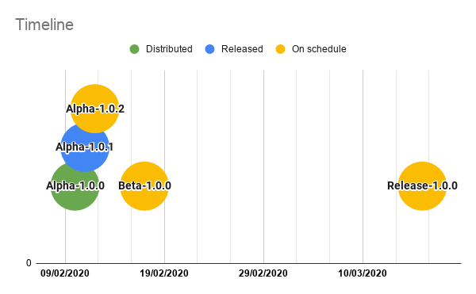

<div align="center">
    
</div>

#  Temopedia

[](https://gitlab.com/G_Roux/temopedia/commits/master)

**WIP:** Mobile app companion for the game [Temtem](https://crema.gg/games/temtem/) to get an easy access to creature's information using [Mael's API](#credits).

I am not affiliated with Temtem's company. This is a personal project I'm doing on my free time.

## Screenshots

<div align="center">
    
    
    
    
</div>

## How to install

### Android

[](https://play.google.com/store/apps/details?id=com.maniak.temopedia)

[Google Playstore](https://play.google.com/store/apps/details?id=com.maniak.temopedia)

### iOS

There is no release on the AppStore yet.
To test the application you need to clone and build the souce code, [Flutter SDK](https://flutter.dev/) is required to do so.

``` bash
git clone https://gitlab.com/G_Roux/temopedia.git
cd temopedia/
flutter build ios
flutter install
```

## Roadmap



## Todo

* [x] API - Load temtems list
* [x] API - Load types list
* [x] API - Load traits list
* [x] API - Load techniques list
* [x] HomePage - Display temtems list
* [x] HomePage - Search bar to filter temtems
* [x] HomePage - Filter Temtems by type
* [x] HomePage - Order Temtems in alphabetical order
* [x] HomePage - Order Temtems by their number
* [x] TemtemPage - Add picture
* [x] TemtemPage - Add traits
* [x] TemtemPage - Add statistics
* [x] TemtemPage - Add trivia
* [x] TemtemPage - Add details
* [x] TemtemPage - Add techiques list
* [x] TemtemPage - Add evolution chain
* [x] TemtemPage - Add locations list
* [x] Traits - Show trait's details inside a popup
* [x] Technique - Show technique's details inside a popup
* [ ] Design - Add animations
* [x] CI/CD
* [x] [Playstore release](#roadmap)

## Author

* [Guillaume Roux](https://gitlab.com/G_Roux) - Junior Developer

## Credits

* [Mael](https://github.com/maael) - The talented developer who made the [API](https://github.com/maael/temtem-api)

