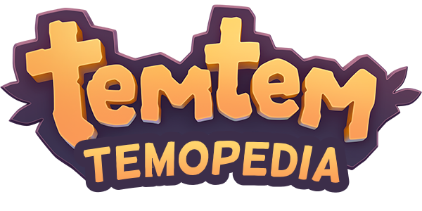
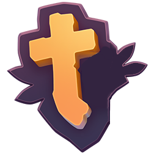
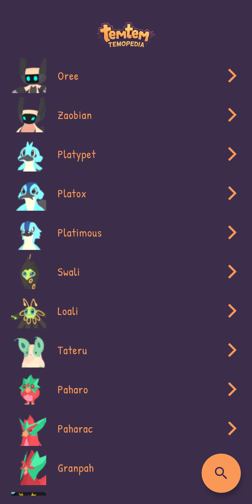
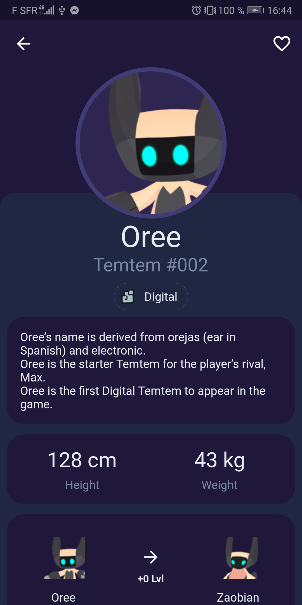
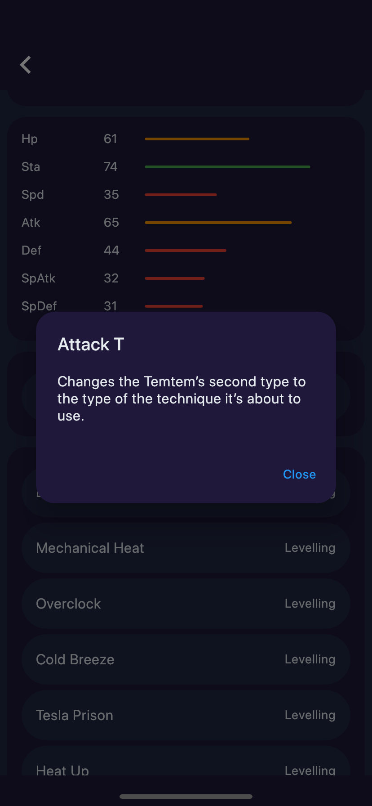
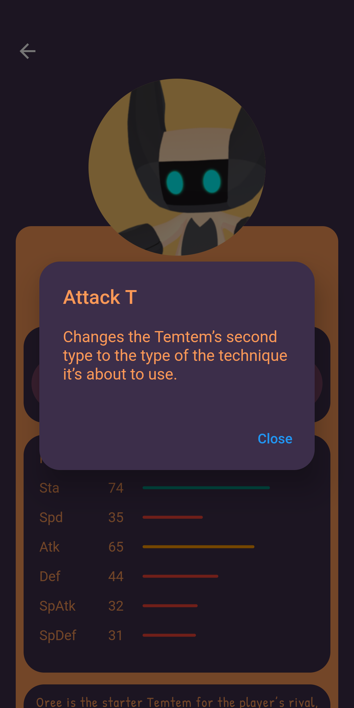

<div align="center">
    
</div>

#  Temopedia

[](https://gitlab.com/G_Roux/temopedia/commits/master)
[](https://codemagic.io/apps/5e4ae040000fe09eb5c118e7/5e4ae040000fe09eb5c118e6/latest_build)

**WIP:** Mobile app companion for the game [Temtem](https://crema.gg/games/temtem/) to get an easy access to creature's information using [Mael's API](#credits).

I am not affiliated with Temtem's company. This is a personal project I'm doing on my free time.

## Screenshots

<div align="center">
    
    
    
    
</div>

## How to install

### Android

[](https://play.google.com/store/apps/details?id=com.maniak.temopedia)

### iOS

There is no release on the AppStore yet.
To test the application you need to clone and build the souce code, [Flutter SDK](https://flutter.dev/) is required to do so.

``` bash
git clone https://gitlab.com/G_Roux/temopedia.git
cd temopedia/
flutter build ios
flutter install
```

## Todo

* [ ] TemtemPage - Display location map **(Not enough data)**
* [ ] TemtemPage - Add type effectiveness
* [ ] UI/UX

## Author

* [Guillaume Roux](https://gitlab.com/G_Roux) - Junior Developer

## Credits

* [Mael](https://github.com/maael) - The talented developer who made the [API](https://github.com/maael/temtem-api)

